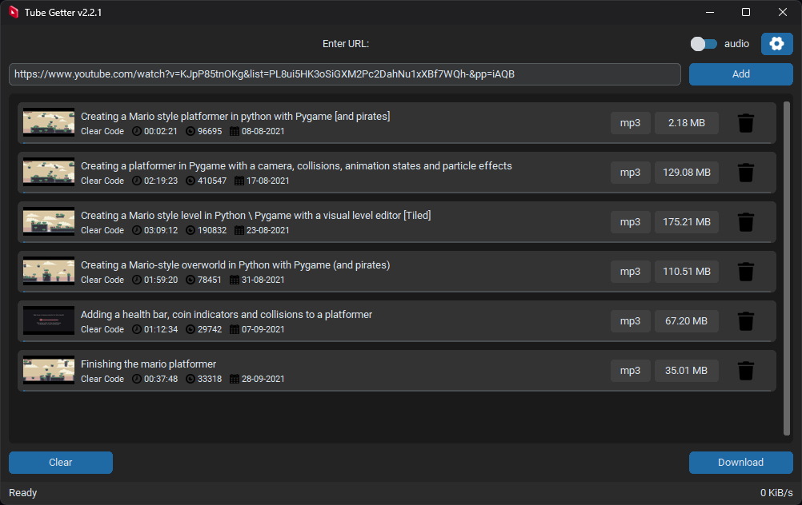
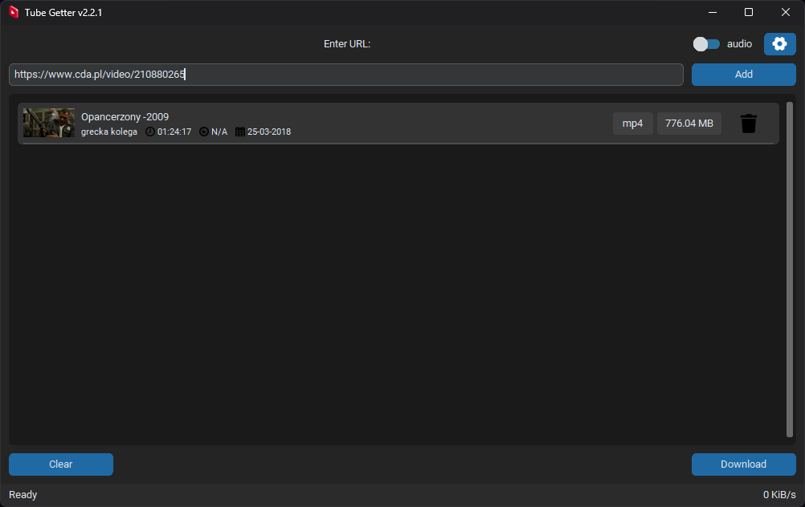
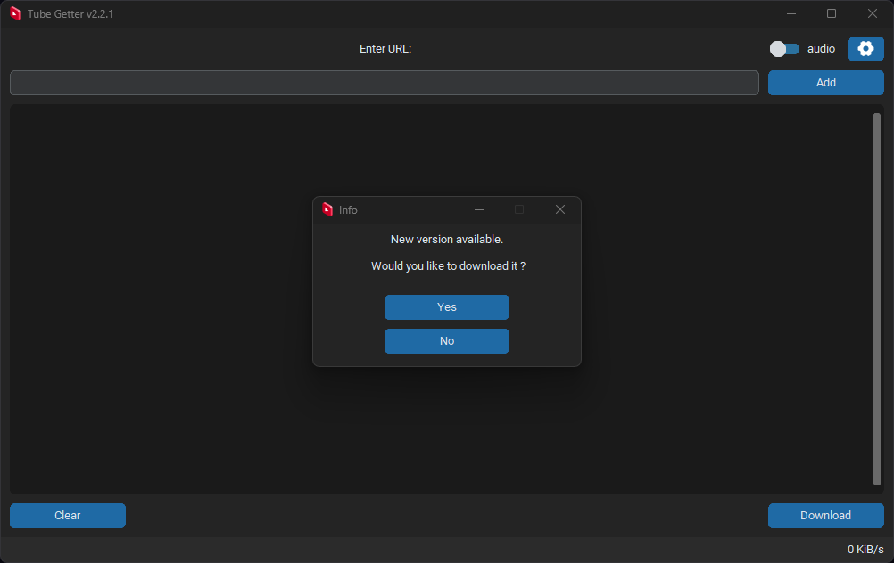

---
Tube Getter is a Python application that allows you to download videos and audio from YouTube, BitChute and cda.pl.
Interface is built with `customtkinter` and media downloaders are built with `pychute`,
`cda_download` and the `pytubefix` library.
---
## **Features**

*   Download video and audio from YouTube, BitChute or cda.pl.
*   Support for downloading individual videos or entire playlists (only for YouTube).
*   Choose the output format (video or audio).
*   Monitor the download progress, including progress, download speed, completion status and conversion status.
*   Choose the output folder in the settings window.

## **Prerequisites**

* pytubefix
* pychute
* cda_download
* customtkinter
* pillow
* beautifulsoup4

## **Installation**

### SOURCE:

Clone the repository:   
`git clone https://github.com/paichiwo/tube-getter.git`

Install the required dependencies:
`pip install -r requirements.txt`

Run the application:   
`python main.py`

### WINDOWS:

Download `tube_getter.exe` from https://github.com/paichiwo/tube-getter/releases/tag/v2.2.6

Run the application. 

Note: Application is portable, no installation required.

Note: Your antivirus software might find this application suspicious. 
This is due to the nature of pyinstaller behavior.
It's a common problem and well acknowledged. 
Exemption might have to be added in windows defender or other antivirus software that you use.

## **Usage**

- Run the application, the window will appear.

- Enter the **YouTube** video URL or playlist URL in the input field and click "Add" or press Enter, 
you can also add URLs one by one.
  You can also enter **BitChute** or **cda.pl** URL (_BitChute and cda supports only one media at a time_).

  
- Switch to Audio or Video to update the table with relevant information.

- Select the download folder by clicking the "Settings" button. 
  Closing the settings window will save your output folder automatically.

- Click the "Download" button to start the download process and monitor the download progress in the table.

## **Contributing**

_I'm constantly working on this application, this code might change a lot._
_If you find any bugs, please feel free to open an issue._

If you are interested in contributing to the development of the Tube Getter,
you are welcome to create a pull request on the project's GitHub repository.

## **License**

This project is licensed under the [MIT License](LICENSE).

## **Acknowledgements**

*   [pytubefix](https://pytubefix.readthedocs.io/en/latest/) - library for downloading YouTube videos
*   [pychute](http://github.com/paichiwo/pychute) - library for downloading BitChute videos
*   [cda_download](https://github.com/paichiwo/cda_download) - library for downloading cda.pl videos