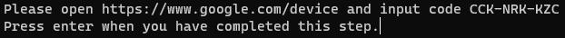
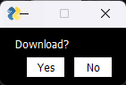
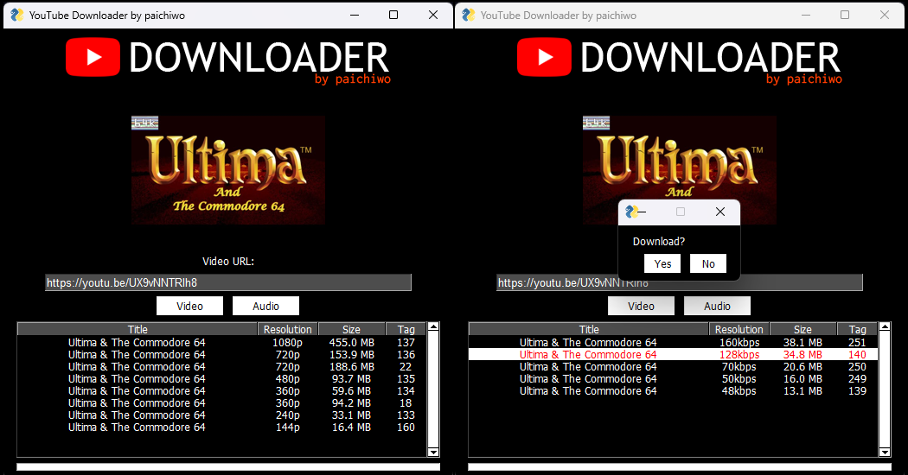

## **YouTube Downloader**

The Python-based YouTube Downloader is a script that enables users to download video or audio files from YouTube with ease. The user interface is built using the PySimpleGUI library, while the PyTube library is employed to implement the video downloading functionality. With a straightforward and user-friendly design, the script offers a hassle-free method for users to obtain their desired YouTube content.

## **Prerequisites**

To run this script, you need to have Python 3.x installed on your system. You can download it from the official website of Python.

Additionally, you need to install the following Python libraries:

*   PySimpleGUI
*   requests
*   io
*   PyTube
*   PIL

You can install these libraries using pip.

`pip install PySimpleGUI requests io PyTube Pillow`

Or you can use the requirements file:

`pip install -r requirements.txt`

## **Usage**

To use the YouTube Downloader, run the following command in your terminal:

`python youtube_downloader.py`

Or just run the application on your favourite IDE.

Once the program starts, you can use the following steps to download a video or audio from YouTube:

* **Note:** When you running application for first time it might ask for authentication:
     
  Just follow these steps, authenticate and you ready to go 

1.  Enter the URL of the video or audio in the "Video URL" field.
2.  Click on the "Video" or "Audio" button to display a table with available streams.
3.  Select a stream from the table.
4.  Click “Yes” on the "Download" pop-up window to download the selected stream.

    

The downloaded files will be saved in the "Downloads" folder in the same directory as the script.  
The supported file formats are MP4 for video files and MP3 (if 128 kbps bitrate is selected) or WebM (if any other bitrate is selected) for audio files.

## **Contributing**

_I'm constantly working on this application, so this code might change a lot._

If you would like to contribute to the YouTube Downloader, feel free to create a pull request on the GitHub repository.

If you are interested in contributing to the development of the YouTube Downloader, you are welcome to create a pull request on the project's GitHub repository.By contributing to the project, you can help improve the functionality, stability, and overall quality of the YouTube Downloader application, which is much appreciated.

## **License**

The YouTube Downloader is licensed under the [MIT License](https://github.com/paichiwo/youtube_downloader/LICENSE).

## **Example** 

