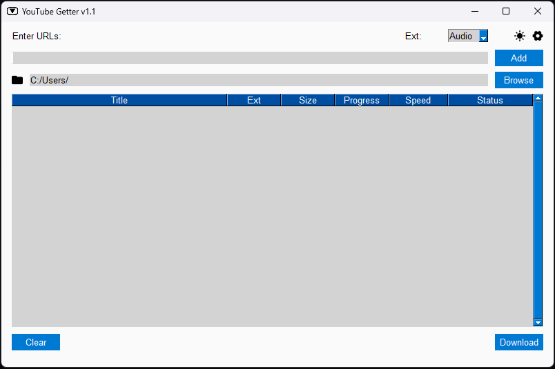

## **Tube Getter**

Tube Getter is a Python application that allows you to download videos and audio from YouTube.
It provides a simple user interface built with PySimpleGUI
and utilizes the pytube library for downloading YouTube content.

## **Features**

*   Download videos and audio from YouTube.
*   Support for downloading individual videos or entire playlists.
*   Choose the output format (mp4 or mp3).
*   Monitor the download progress, including file size, download speed, and completion status.
*   Customize the download folder.

## **Prerequisites**

*   Python 3.x
*   PySimpleGUI
*   pytube

## **Installation**

### SOURCE:

Clone the repository:   
`git clone https://github.com/paichiwo/tube-getter.git`

Install the required dependencies or run `requirements.txt`:   
`pip install PySimpleGUI pytube` or `pip install -r requirements.txt`

Run the application:   
`python tube_getter.py`

### WINDOWS:

Download `tube_getter.exe` from https://github.com/paichiwo/tube-getter/releases/tag/v1.1   
Run the application. 

Note: Application is portable, no installation required.

## **Usage**

- Run the application, the window will appear.

- Enter the YouTube video URL or playlist URL in the input field and click "Add" or press Enter.

- Choose the output format (Video or Audio) from the dropdown menu.

- Select the download folder by clicking the "Browse" button or manually enter the folder path.

- The table will display the list of videos or audio in the playlist, along with their details.

- Click the "Download" button to start the download process and monitor the download progress in the table.

- Completed downloads will show the status as “Complete.”

## **Contributing**

_I'm constantly working on this application, this code might change a lot._

If you find any issues, feel free to report.

If you are interested in contributing to the development of the YouTube Downloader,
you are welcome to create a pull request on the project's GitHub repository. By contributing to the project,
you can help improve the functionality, stability, and overall quality of the Tube Getter application,
which is much appreciated.

## **License**

This project is licensed under the [MIT License](LICENSE).

## **Acknowledgements**

*   [PySimpleGUI](https://pysimplegui.readthedocs.io/) - Python GUI Framework
*   [pytube](https://pytube.io/) - Python library for downloading YouTube videos