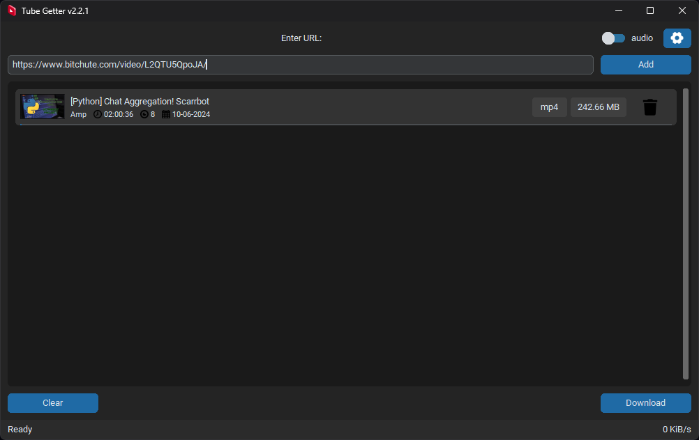

---
Tube Getter is a Python application that allows you to download videos and audio from YouTube and BitChute.
It provides a simple user interface built with customtkinter, pychute and the pytubefix library.
---
## **Features**

*   Download video and audio from YouTube or BitChute.
*   Support for downloading individual videos or entire playlists (only for YouTube).
*   Choose the output format (video or audio).
*   Monitor the download progress, including progress, download speed, and completion status.
*   Choose the download folder in the settings window

## **Prerequisites**

* pytubefix
* pychute
* customtkinter
* pillow
* moviepy
* beautifulsoup4

## **Installation**

### SOURCE:

Clone the repository:   
`git clone https://github.com/paichiwo/tube-getter.git`

Install the required dependencies:
`pip install -r requirements.txt`

Run the application:   
`python main.py`

### WINDOWS:

Download `tube_getter.exe` from https://github.com/paichiwo/tube-getter/releases/tag/v2.1.3

Run the application. 

Note: Application is portable, no installation required.

Note: Your antivirus software might find this application suspicious. 
This is due to the nature of pyinstaller behavior.
It's a common problem and well acknowledged. 
Exemption might have to be added in windows defender or other antivirus software that you use.

## **Usage**

- Run the application, the window will appear.

- Enter the YouTube video URL or playlist URL in the input field and click "Add" or press Enter, 
you can also add URLs one by one.
  You can also enter BitChute URL (BitChute supports only one media at a time).

  
- Switch to Audio or Video to update the table with relevant information.

- Select the download folder by clicking the "Settings" button. 
  Closing the settings window will save your output folder automatically.

- Click the "Download" button to start the download process and monitor the download progress in the table.

## **Contributing**

_I'm constantly working on this application, this code might change a lot._
_If you find any bugs, please feel free to open an issue._

If you are interested in contributing to the development of the YouTube Downloader,
you are welcome to create a pull request on the project's GitHub repository. 
By contributing to the project, you can help improve the functionality, 
stability, and overall quality of the Tube Getter application, which is much appreciated.

## **License**

This project is licensed under the [MIT License](LICENSE).

## **Acknowledgements**

*   [pytubefix](https://pytubefix.readthedocs.io/en/latest/) - library for downloading YouTube videos
*   [pychute](http://github.com/paichiwo/pychute) - library for downloading BitChute videos
